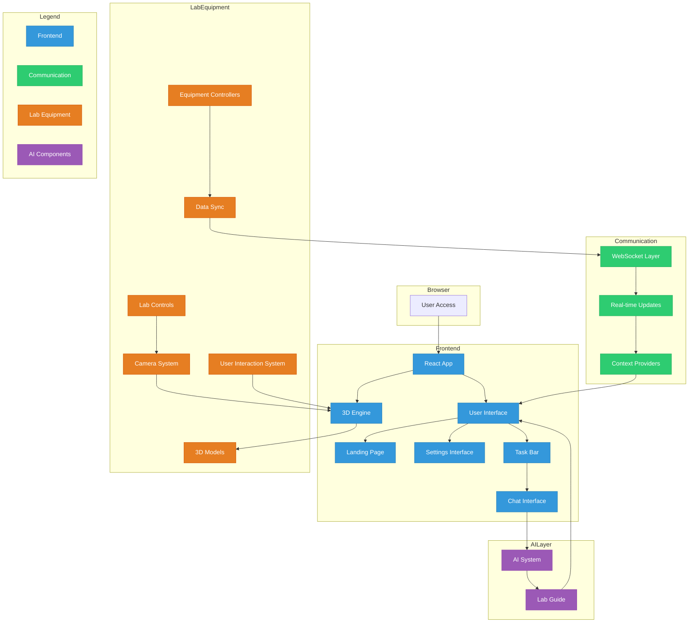

# Web-Based Robotics Quantum Labs

**Web-Based Robotics Quantum Labs** is a cutting-edge system that models 8
different labs, enabling students from anywhere in the world to interact with
remote labs in real time. This platform bridges the gap between virtual and
physical spaces, allowing students to manipulate and control lab equipment
through realistic 3D models. The system provides real-time updates, reflecting
changes in the physical lab environment, making it a fully immersive and
accessible learning experience in quantum robotics.

Check out this graph of our systems:



## Memebers:

We currently have 10 memebers on the team from a variety of majors from EE to CS.

### Current Features:

- **Rendered and Functional Components**: Added dragging, rotating, and twisting functionalities for 8 individual lab components.
- **Board Functionality**: Implemented a board to provide an overview of the lab and interactions.
- **AI Chat Integration**: Added a chat-based AI to guide students to each lab equipment, offering assistance throughout the lab.
- **Component Placeholders**: Added placeholders to enable real-time updates to lab components as they are interacted with.

---

### How to Run This on Your Computer

Follow these steps to run iStat locally:

1. **Clone the repository**:

   ```bash
   git clone https://github.com/yourusername/istat-frontend.git
   ```

2. **Navigate into the project directory**:

   ```bash
   cd istat-frontend
   ```

3. **Install dependencies**:
   Make sure you have Node.js and npm installed. Then run:

   ```bash
   npm install
   ```

4. **Build for production**:
   To build the project for production, use:

   ```bash
   npm run dev
   ```

5. **Open the application**:
   Open your browser and navigate to:

```
http://localhost:3000
```

## Devenv instructions

Alternatively, `devenv` + [Nix](https://nixos.org/) can be used to
automatically bring up a working environment. Install Nix and enable the
experimental flakes feature. Enter the project directory and type

```bash
nix develop --impure
```

All dependencies will be fetched automatically. Once the command finishes, run

```bash
devenv up
```

A development server will be started at `localhost:5173`
